<picture>
  <source media="(prefers-color-scheme: dark)" srcset="dark.svg">
  <source media="(prefers-color-scheme: light)" srcset="light.svg">
  
</picture>

## Projects

### 🫀 CardioRisk ML Pipeline
[View Repo](https://github.com/ahmadbhatti-2/CardioRisk-ML-Pipeline)

Cardiovascular disease risk prediction — deployed live

Tech: XGBoost, FastAPI, Streamlit, Render

### 📉 Telecom Customer Churn Prediction
[View Repo](https://github.com/ahmadbhatti-2/Telecom-customer-churn-prediction)

End-to-end ML pipeline with SMOTE, CV tuning and batch inference

Tech: Scikit-Learn, XGBoost, Pipeline Architecture

## Connect

