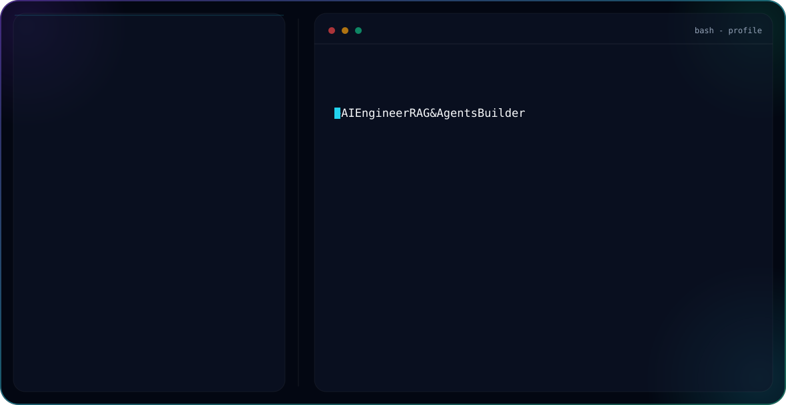

<picture>
  <source media="(prefers-color-scheme: dark)" srcset="dark.svg">
  <source media="(prefers-color-scheme: light)" srcset="light.svg">
  
</picture>

## Projects

### Enterprise Compliance & Risk Intelligence Platform
[View Repo](https://github.com/ahmadbhatti-2/enterprise-compliance-rag)

Full-stack RAG platform for enterprise compliance, AI risk, privacy, and governance documents.

Tech: Python, FastAPI, LangChain, ChromaDB, BM25, RRF, Cross-Encoder Reranking, Gemini, React

### 🏋️ FitMind — AI Fitness Recommendation & Coaching System
[View Repo](https://github.com/ahmadbhatti-2/FitMind-AI-Fitness-Assistant)

AI-powered personalized fitness assistant that generates explainable workout and nutrition recommendations based on user profile, goals, history, recovery, and feedback.

Tech: Python, FastAPI, LangGraph, Gemini, PostgreSQL, React, Rule-Based Recommendation

### 🫀 CardioRisk ML Pipeline
[View Repo](https://github.com/ahmadbhatti-2/CardioRisk-ML-Pipeline)

Cardiovascular disease risk prediction — deployed live

Tech: XGBoost, FastAPI, Streamlit, Render

### 📉 Telecom Customer Churn Prediction
[View Repo](https://github.com/ahmadbhatti-2/Telecom-customer-churn-prediction)

End-to-end ML pipeline with SMOTE, CV tuning and batch inference

Tech: Scikit-Learn, XGBoost, Pipeline Architecture

## Connect

